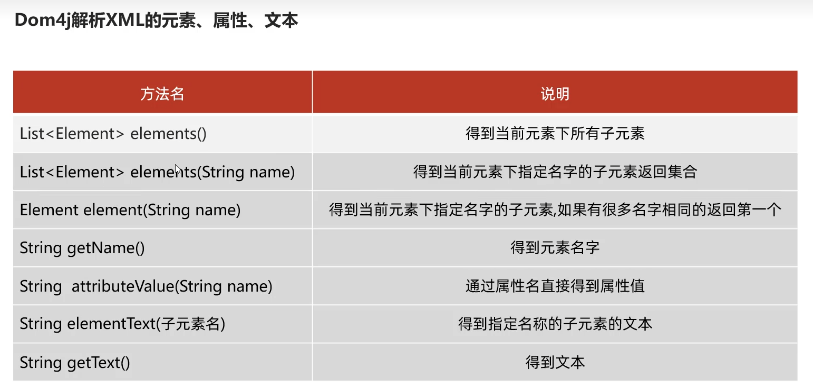

# 常用API

### Object、Objects

<figure><figcaption></figcaption></figure>

<figure><figcaption></figcaption></figure>

<figure><figcaption></figcaption></figure>

<figure><figcaption></figcaption></figure>

<figure><figcaption></figcaption></figure>

#### 对象进行内容比较的时候建议使用Objects提供的equal方法，结果一样但更安全

### StringBuilder

<figure><figcaption></figcaption></figure>

<figure><figcaption></figcaption></figure>

<figure><figcaption></figcaption></figure>

<figure><figcaption></figcaption></figure>

#### 为什么拼接、反转字符串建议使用StringBuilder？

* String: 内容不可变、拼接字符串效率差
* &#x20;String Builder：内容可变、拼接字符串性能好
* 定义字符串使用String
* 拼接、修改等操作字符串使用StringBuilder
