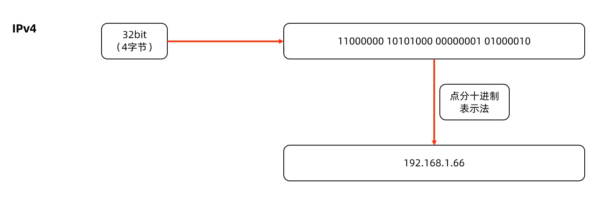

# TCP通信

## TCP通信模式演示

<figure><figcaption></figcaption></figure>

<figure><figcaption></figcaption></figure>

<figure><figcaption></figcaption></figure>

```
// 一发一收客户端
//创建Socket通信管道请求有服务端的连接
Socket socket = new Socket("127.0.0.1",7777);

//从scoket 通信管道中得到一个字节输出流，负责发送数据
OutputStream os = socket.getOutputStream();

//把低级的字节流包装成打印流
PrintStream ps = new PrintStream(os);

//发送消息
ps.print("lalall");
ps.flush();

//服务端
//注册端口
ServerSocket serverSoket = new ServerSocket(7777);

//必须调用accept方法：等待客户端的Socket连接请求，建立Socket通信管道
Socket socket = serverSocket.accept();

//从socket通信管道中一个字节输入流
InputStream is = socket.getInputStream();

//把字节输入流包装成缓冲字符输入流进行消息的接收
BufferedReader br = new BUfferedReader(new InputStreamReader(is));

```

<figure><figcaption></figcaption></figure>

## 如何实现

* 主线程定义了循环负责接受客户端Socket管道连接
* 每接收到一个Socket通信管道后分配一个独立的线程负责处理它

## 线程池优化

<figure><figcaption></figcaption></figure>

### 线程池优势

* 服务端可以复用线程处理多个客户端，可以避免系统瘫痪
* 适合客户端通信时长较短的场景
